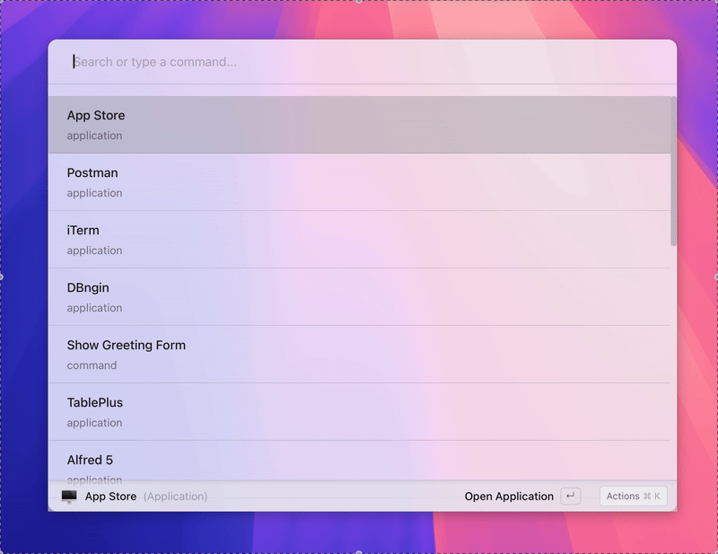

# Asyar

**An open-source alternative to Raycast.**

Asyar is a fast, extensible command launcher for macOS, Windows, and Linux. Search for apps, run commands, manage your clipboard, and extend everything through a growing ecosystem of community extensions.

Built with [Tauri v2](https://tauri.app/), [SvelteKit](https://kit.svelte.dev/), and [TypeScript](https://www.typescriptlang.org/).



---

> **Note:** Asyar is under active development and is not yet considered stable or production-ready. You may encounter bugs or breaking changes. Contributions are welcome!

---

## Features

- **Application Launcher** — Find and launch any installed application instantly
- **Clipboard History** — Search and reuse anything you've copied
- **Extension Store** — Browse and install extensions from [asyar.org](https://asyar.org)
- **Live Tray Menu** — Extensions can show real-time status in your system tray
- **Cross-Platform** — Runs natively on macOS, Windows, and Linux
- **Keyboard-First** — Global hotkey (`Cmd+K` / `Ctrl+K`) to summon from anywhere

## How Extensions Work

Asyar's power comes from its extension system. Extensions add commands to the launcher, contribute live search results, and open rich UI panels.

- **Built-in extensions** run natively alongside the app for maximum speed
- **Installed extensions** run in secure sandboxes — they can't crash the app or access other extensions' data
- **Build your own** with the [Asyar SDK](https://github.com/Xoshbin/asyar-sdk) using any web framework (Svelte, React, Vue, or vanilla JS)

## Tech Stack

| Layer | Technology |
|-------|-----------|
| Backend | Rust (Tauri v2) — native OS integration, security, performance |
| Frontend | SvelteKit — reactive UI with instant updates |
| Extensions | TypeScript + any web framework, sandboxed in iframes |
| Extension Store | [asyar.org](https://asyar.org) — browse, publish, and install |

## Build an Extension

```bash
npm install -g asyar-sdk
```

The `asyar` CLI handles the full workflow — scaffolding, development, building, and publishing:

```bash
asyar dev        # development mode with hot reload
asyar build      # production build
asyar publish    # package and publish to the store
```

See the [Extension Development Guide](docs/extension-development.md) for the full walkthrough.

## Contributing

We welcome contributions! To set up the full development environment:

```bash
git clone https://github.com/Xoshbin/asyar.git
cd asyar
node setup.mjs
```

This clones all repositories, links the SDK, installs dependencies, and verifies the setup in one command. See the [asyar](https://github.com/Xoshbin/asyar) repo for the full development guide.

For architecture details, see [docs/ARCHITECTURE.md](docs/ARCHITECTURE.md).

### Recommended IDE

[VS Code](https://code.visualstudio.com/) + [Svelte](https://marketplace.visualstudio.com/items?itemName=svelte.svelte-vscode) + [Tauri](https://marketplace.visualstudio.com/items?itemName=tauri-apps.tauri-vscode) + [rust-analyzer](https://marketplace.visualstudio.com/items?itemName=rust-lang.rust-analyzer)

## License

Distributed under the AGPLv3 License. See [LICENSE](LICENSE.md) for more information.
