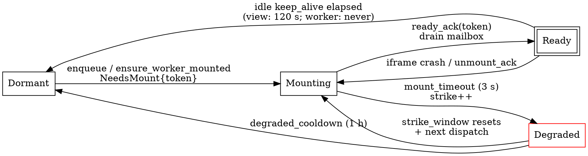

# Extension Runtime — How Worker and View Iframes Are Mounted, Driven, and Talked Between

This page documents the **`extension_runtime`** Rust module
([`asyar-launcher/src-tauri/src/extensions/extension_runtime/`](../../../asyar-launcher/src-tauri/src/extensions/extension_runtime/))
and the launcher-side machinery that drives the two iframes Asyar
materialises for every Tier 2 extension. Read [the IPC bridge](./ipc-bridge.md)
first if you haven't — this doc assumes you know how individual service
calls travel.

## Two contexts per extension

Every enabled Tier 2 extension is mounted as **two independent iframes**:

| Role | HTML | Lifecycle | Hosts |
|---|---|---|---|
| **Worker** | `worker.html` | Always-on (mounted when the extension is enabled, unmounted only on disable / uninstall) | Push subscriptions, scheduled ticks, `timers:*`, tray writes (`statusBar`), notification-action handlers, RPC handlers, `search()` |
| **View** | `view.html` | On-demand (mounted when a `mode: "view"` command opens, evicted ~120 s after last interaction) | UI only — Svelte components, DOM helpers, theme injection, view-search input |

Both iframes are sandboxed at the same origin
(`asyar-extension://<id>/` on macOS/Linux, `http://asyar-extension.localhost/<id>/`
on Windows) but they are otherwise independent JS contexts: their own
`MessageBroker`, their own `ExtensionContext`, their own listeners. The two
roles never share JS state. They cooperate through the launcher.

## Lifecycle state machine

The same state alphabet drives both roles. The states and transitions are
defined in [`extension_runtime/types.rs`](../../../asyar-launcher/src-tauri/src/extensions/extension_runtime/types.rs)
and [`extension_runtime/context.rs`](../../../asyar-launcher/src-tauri/src/extensions/extension_runtime/context.rs).



State alphabet:

- **`Dormant`** — no iframe in the DOM. The default state. Dispatching to
  a Dormant context returns `NeedsMount { mount_token }`; the launcher
  emits a `EVENT_MOUNT` event with that token, and the dispatcher enqueues
  the message in the per-context mailbox.
- **`Mounting { since, mount_token }`** — the iframe element exists and
  its `src` is loading. The mailbox is accumulating messages. After
  `mount_timeout` (default 3 s) without a `ready_ack`, the launcher fires
  `on_mount_timeout` which raises a strike and may transition to Degraded.
- **`Ready { last_activity, mount_token }`** — the iframe has posted
  `asyar:extension:loaded` carrying its `mount_token`, the host called
  `on_ready_ack(...)`, and the launcher inline-delivered every message
  that had accumulated in the mailbox during Mounting.
- **`Degraded { strikes, last_strike, cooldown_until }`** — three failed
  mounts inside `strike_window` (300 s) put the context in Degraded. Pending
  user-facing messages are reported as drops; background messages are
  silently dropped. After `degraded_cooldown` (1 h), the next dispatch
  retries from Dormant.

`RuntimeConfig::default()` pins the timers:

| Field | Value | Notes |
|---|---|---|
| `worker.keep_alive` | `None` | Worker never evicts on idle. |
| `view.keep_alive` | `Some(120 s)` | View evicts after 120 s of inactivity. |
| `mount_timeout` | `3 s` | Same for both roles. |
| `strike_window` | `300 s` | Sliding window for strike accumulation. |
| `strike_threshold` | `3` | Mounts before a context is Degraded. |
| `degraded_cooldown` | `3600 s` | Recovery wait. |
| `tick_interval` | `1 s` | Tick driver cadence. |

## Mailbox + mount tokens

Each context owns a per-extension `PendingMessage` mailbox. When dispatch
arrives while the context is Dormant or Mounting, the message is enqueued
and the dispatcher returns:

```rust
pub enum DispatchOutcome {
    ReadyDeliverNow { messages: Vec<PendingMessage> }, // Ready: deliver now
    MountingWaitForReady,                              // Mounting: queued, drained by ready_ack
    NeedsMount { mount_token: u64 },                   // Dormant: caller emits mount event
    Degraded { strikes: u32 },                         // Degraded: dropped
}
```

**Mount tokens** are monotonically increasing 64-bit ids the launcher
generates per mount attempt. The token is sent to the iframe via the
mount event, the iframe echoes it back in `asyar:extension:loaded`, and the
launcher's `on_ready_ack(extension_id, mount_token, role, now)` only
drains the mailbox if the token matches the current `Mounting` state. Tokens
solve a TOCTOU class of bugs: an iframe that crashes mid-mount and its
late `loaded` event cannot promote a *new* mount attempt to Ready.

When `on_ready_ack` runs successfully, the state machine transitions to
`Ready` and returns `Vec<PendingMessage>` to the launcher, which inline-delivers
each message to the iframe via `asyar:action:execute` /
`asyar:invoke:command` envelopes. This is the **ready-ack drain**.

## Mount / unmount events

The launcher's frontend listens for two Rust-side events that drive the
state machines:

- **`extension_runtime:mount`** — payload `{ extensionId, role, mountToken }`. The
  frontend's iframe registry materialises a new `<iframe data-extension-id="..." data-role="...">`,
  appended to the `WorkerIframes` host (for `role: 'worker'`) or to the
  view container.
- **`extension_runtime:unmount`** — payload `{ extensionId, role }`. The
  frontend removes the iframe from the DOM and posts an `unmount_ack` so
  the state machine resets to Dormant cleanly.

The `WorkerIframes` host is registry-driven: it iterates over the set of
extensions that need a worker mount and renders one hidden iframe per
entry. Unmounts are a DOM-level removal — there is no graceful destroy
hook in the iframe itself; teardown rules out anything that needs an
ordered shutdown (in practice, that is everything timer-related, which is
why `timers:*` is launcher-persisted, not iframe-persisted).

## State broker — `state:*` namespace

Built in [`extension_runtime/manager.rs`](../../../asyar-launcher/src-tauri/src/extensions/extension_runtime/manager.rs)
and the [`extension_state` Rust module](../../../asyar-launcher/src-tauri/src/extensions/extension_state/),
the state broker is the launcher's view↔worker shared bus.

- **Auto-scoped namespace.** All `state:*` calls are auto-scoped to the
  caller's `extensionId`. The IPC router auto-injects `extensionId` so an
  extension cannot read or write another extension's state, even if its
  own permissions are loose. The proxy lives in
  [`asyar-sdk/src/services/ExtensionStateProxy.ts`](../../../asyar-sdk/src/services/ExtensionStateProxy.ts).
- **Push fan-out via subscriptions.** When a write hits the broker, the
  launcher fans the new value out to **every iframe of that extension that
  has a live subscription**. The view subscribes from a Svelte component
  (`$effect` watching `state.subscribe('phase', handler)`) and stays
  subscribed for the iframe's lifetime; the worker can also subscribe if
  it wants to react to writes from other surfaces (settings panels, deep
  links, etc.).
- **`state:*` covers RPC.** The same namespace carries the view→worker
  RPC envelopes (`state:rpcRequest`, `state:rpcReply`, `state:rpcAbort`).
  The state machine treats them as `Action` mailbox entries on the worker
  side, so a Dormant worker is mounted on demand for the call.

## RPC primitive

The SDK ships `extensionRpc` ([`asyar-sdk/src/services/ExtensionRpc.ts`](../../../asyar-sdk/src/services/ExtensionRpc.ts))
on top of the state broker. The view-side public API:

```ts
// View context (asyar-sdk/view)
const stats = await context.request<{}, { rounds: number }>('getStats', {}, {
  timeoutMs: 5_000,        // default
  signal: abortController.signal,  // optional, cooperative abort
});
```

The worker-side public API:

```ts
// Worker context (asyar-sdk/worker)
const dispose = context.onRequest<{}, { rounds: number }>('getStats',
  async (_payload, signal) => {
    if (signal.aborted) throw new Error('aborted');
    return { rounds: await readRounds() };
  },
);
// later: dispose(); // unregister
```

Behaviour:

- **Correlation IDs.** Each `request(...)` generates a UUID. A reply that
  doesn't match a live correlation is silently dropped.
- **Default 5 s timeout.** Configurable per call via `opts.timeoutMs`.
  On timeout the SDK posts `state:rpcAbort` and rejects the promise with
  a timeout error. Ignored aborts on the worker side are detectable: the
  late reply is dropped, but the user-facing error fires immediately.
- **AbortSignal.** A caller-provided `AbortSignal` aborts the same way the
  internal timeout does. The worker handler receives a real `AbortSignal`
  it can pass into `fetch(...)` or check at yield points.
- **No worker→worker, no view→view.** `request()` only goes view→worker;
  `onRequest()` is worker-only.

### View → worker RPC sequence

```
view.svelte               view-side ExtensionRpc           Launcher state broker             worker-side ExtensionRpc        worker handler
─────────────             ─────────────────────             ─────────────────────             ─────────────────────────       ──────────────
context.request(
  id='getStats',
  payload, opts)
            ──────────────►
                          generate correlationId
                          deferred(timeout=5000ms)
                          broker.invoke(
                            'state:rpcRequest',
                            { id, correlationId, payload })
                                     ─────────────────────────►
                                                              IpcRouter: identity, perms
                                                              ExtensionStateService.rpcRequest
                                                                ContextMachine.enqueue (worker)
                                                                  if Ready  → ReadyDeliverNow
                                                                  if Dormant → mount + queue
                                                                  if Mounting → queue
                                                              once Ready, deliver as
                                                              asyar:action:execute envelope
                                                                                          ─────────────────────────►
                                                                                                                          Worker module-load interceptor
                                                                                                                          extensionRpc.deliverActionPayload
                                                                                                                            └─ handler(payload, signal)
                                                                                                                                                   ──────────►
                                                                                                                                                              run handler
                                                                                                                                                              return result
                                                                                                                                                   ◄──────────
                                                                                                                          broker.invoke(
                                                                                                                            'state:rpcReply',
                                                                                                                            { correlationId, result })
                                                                                          ◄─────────────────────────
                                                              IpcRouter routes reply
                                                              posts asyar:action:execute reply
                                                              to view iframe
                                     ◄─────────────────────────
                          deferred resolves
            ◄──────────
result/error to caller
```

If the view's `AbortSignal` fires during the round-trip:

```
view: abortController.abort()
       ──► broker.invoke('state:rpcAbort', { correlationId })
              ──► launcher posts asyar:action:execute
                  with __rpc__: 'abort' to worker
                     ──► worker AbortSignal fires for the in-flight handler
                         (handler can yield an early throw/return)
              ──► view-side promise rejects with AbortError
                  (any late reply is dropped)
```

## What lives where

These rules follow from the lifecycle model. They are enforced by code
review (see the `architectural-integrity` and `review-ipc` skills under
[`asyar-launcher/.claude/skills/`](../../.claude/skills/)).

| Belongs in worker | Belongs in view |
|---|---|
| Push subscriptions (`appEvents`, `applicationIndex`, `systemEvents`, `state:*`) | Svelte components |
| `commands.onCommand(id, handler)` registrations | `commands.onCommand(...)` for handlers that need DOM (rare) |
| `timers:*` schedules and callbacks | Anything reading the document, focus, selection |
| `statusBar:*` writes (tray icons) | `feedback`, `interop`, `clipboard-history`, `selection` calls |
| Notification action callbacks (declared via `actions.registerActionHandler` from the worker) | UI-bound action handlers |
| `search()` for `searchable: true` extensions | View-search keystroke handling (`asyar:view:search` / `asyar:view:submit`) |
| RPC handlers (`context.onRequest`) | RPC callers (`context.request`) |

If something needs to keep working while the launcher is closed (the user
hit Escape), it must live in the worker. The view iframe is gone within
~2 minutes of the panel closing; relying on a setTimeout there is a bug.

## See also

- [IPC bridge](./ipc-bridge.md) — the per-message protocol, permission
  gate, role-aware iframe selection.
- [Extension type reference](../reference/extension-types/extension.md) —
  the manifest fields that drive which contexts an extension materialises.
- [Background scheduling](../reference/background-scheduling.md) — how
  `commands[].schedule` ticks are routed to the worker.
- [`architectural-integrity` skill](../../.claude/skills/architectural-integrity/SKILL.md) ·
  [`review-ipc` skill](../../.claude/skills/review-ipc/SKILL.md) ·
  [`service-singletons` skill](../../.claude/skills/service-singletons/SKILL.md).
